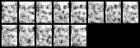

# GAN trained on Frey Face Dataset

Generate new samples using Frey Face Dataset and GAN.

Dataset: https://cs.nyu.edu/∼roweis/data/frey_rawface.mat

This program is part of Deep Learning Course - CSL7590

## Directory Structure

- project_root/
  - data/
    - frey_rawface.mat
  - model/
    - discriminator.pth
    - generator.pth
  - output/
  - training_images/
  - training_output/
    - discriminator_architecture.png
    - generator_architecture.png
    - training_progress.gif
  - eval.py
  - gan.py
  - generate_training_gif.py
  - preprocess_data.py
  - train.py
  - visualize_data.py

1. `gan.py` contains the model architecture.
2. `eval.py` is the evaluation script to generate 10 images.
3. `train.py` trains the model on Frey Rawface dataset.


## Pretrained Model

The pretrained generator and discriminators are stored in the `model` folder as `generator.pth` and `discriminator.pth`.

#### Training
The model is trained for 50 epochs with a learning rate of 0.0002.



#### Training Loss
The discriminator loss is lesser than generator loss which is desired as it can detect fake images better. The generator loss is also good as it is able to generate real like samples.

```
Discriminator Loss: 0.6325072050094604, 
Generator Loss: 0.822232723236084
```

#### Generated Samples

Here are some of the generateed samples on the pretrained model.


## How to Run?

#### Setup Environment

1. Setup environment. Preferrably use anaconda.
    ```
    conda env create -f environment.yml
    ```
2. Activate Conda environment
    ```
    conda activate deep_learning
    ```
3. Create an empty folder with names training_images, training_output and output.


#### Run Scripts

1. Training

```
python train.py
```

The model gets stored inside the model directory as generator.pth and discriminator.pth

2. Eval - This will generate 10 images

```
python eval.py
```

This will use pretrained model inside model directory - generator.pth and discriminator.pth